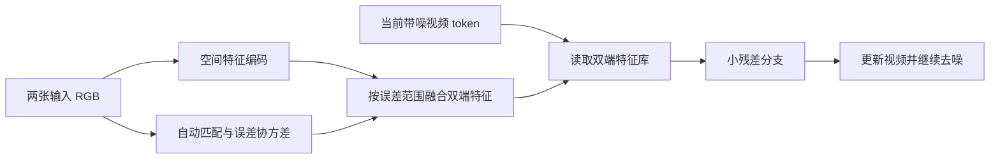

# 双视角物体过渡视频：基于教材的 CV 架构注入方案调研

版本：0.3 · 日期：2026-09-13 · 属性：调研结果文档

任务：输入同一静态物体的两张不同视角 RGB 图片，生成连接两端的过渡视频。

本文件按本次要求使用版本 0.3；此前同版本的“MC 交比 Demo 六问答疑与方案修订”保留。本次重新评估选题，不把此前交比方案的可行性判断作为前提。下文的推荐方案均是**待验证的研究假设**，本次没有训练模型，也没有得到实验增益。

## 先读这一页

**VACE 和 CamI2V 都在潜空间中生成。潜空间不是交比方案的主要障碍；主要障碍是，你必须先获得可靠的对应关系和中间视角的几何位置，交比本身却不能替你获得它们。**

我建议停止把“3D 共线四点交比注意力”作为当前任务的主线。它可以保留为人造场景中的几何诊断，但不应要求泛化测试中的用户继续找直线、标四点。换成像素空间扩散也不会消除这个信息缺口。

像素空间扩散并没有过时。与本任务最相关的是 CVPR 2025 的 **VIVID：Novel View Synthesis with Pixel-Space Diffusion Models**；较新的通用图像研究有 **JiT、PixelDiT**，视频插帧方向有 **SPEED**。不过，“像素空间的新视图生成”“相邻帧插值”和“两张宽基线图片生成完整视频”是不同能力，不能直接互换。[VIVID][S03]、[JiT][S04]、[PixelDiT][S05]、[SPEED][S06]

全面筛选后，更值得做小实验的三个问题是：

| 优先次序 | 教材出发点 | 真正要验证的问题 | 人工标注要求 | 当前判断 |
|---|---|---|---|---|
| 1：先验证 | Harris、孔径问题、概率误差 | **同样“不太确定”，沿边缘不确定与四面都不确定，是否应该采用不同形状的跨视图注意力？** | 测试时零人工对应点；训练可用渲染真值 | 信号自动获取最清楚，适合先做机制实验；新颖性需要严格对照 RoMa v2 与 ConfCtrl |
| 2：条件成立再做 | 滞后阈值、跟踪遮挡、前景背景分离 | **暂时看不见一个表面时，怎样保留它的身份，又不把它画到遮挡物前面？** | 测试时零人工遮挡标签；训练用自动可见性监督 | 与过渡视频的失败现象直接相关，但“加记忆/加遮挡权重”已有大量工作 |
| 3：较高风险探索 | Hough、RANSAC、粒子滤波 | **两图支持多个几何解释时，怎样让整段视频采用同一个解释，避免各像素各选各的？** | 测试时自动匹配、自动生成假设 | 研究问题较有力度，工程成本与失败风险也最高 |

另保留一个小模块方向：**边界阻隔下的可靠对应传播**，来自距离函数、连通性和主动轮廓。它适合作为前两项的辅助消融，暂不足以单独支撑通用视频生成课题。

**没有找到可以负责任地承诺“绝无同类工作”的方向。** 本报告给出的是“已有方法尚未直接覆盖、值得验证的具体机制”，同时列出最接近的反例。尤其是以下想法不能再当作主要创新：普通对极注意力、光流引导注意力、首尾帧注意力加权、相机射线位置编码、置信度加权点云、Kalman 式特征更新、一般的前后向一致性。[CamI2V][S01]、[Motion-I2V][S10]、[KAB/ReTRo][S09]、[ConfCtrl][S08]、[PRoPE][S16]、[双向循环插值][S24]

建议先读第 1–3 节消除概念问题，再读第 6 节选方案；第 7–9 节用于决定实验是否值得投入。

## 1. VACE、CamI2V 与“普通扩散模型”究竟有什么区别

### 1.1 先把三个互不等价的分类分开

| 分类轴 | 两端示例 | 回答什么问题 |
|---|---|---|
| 生成变量所在空间 | RGB 像素 / VAE 潜变量 | 在什么变量上加噪、预测与更新？ |
| 训练与采样形式 | 扩散去噪 / rectified flow、flow matching | 怎样构造噪声到数据的学习问题？ |
| 网络组织方式 | U-Net / DiT | 用什么网络处理这些变量？ |

因此，“潜空间模型”和“扩散模型”不是对立概念。若你说的“普通”是“不经过 VAE 压缩”，准确称呼是**像素空间扩散模型**。Wan 系列常用 rectified flow；这里把它和扩散生成放在同一研究范围，但不把二者训练公式混为一谈。

潜空间的流程可以写为：

```text
训练视频 RGB → VAE 编码 → 干净潜变量 z
                            ↓ 加噪或构造 flow 路径
两端图片、其他条件 → 去噪网络预测并更新 z → VAE 解码 → RGB 视频
```

像素空间模型直接更新 RGB 变量，但其网络内部依然会产生特征图和注意力 token，也可能分块、降采样或使用级联超分辨率。它并不是逐个像素按顺序作画。

### 1.2 已核实的模型情况

| 模型 | 表示与架构 | 对当前选题的意义 |
|---|---|---|
| Wan2.1-VACE | 视频 VAE 潜空间，Wan DiT；VACE 把视频、掩码、参考图组织成条件分支 | 可用作现成的多条件视频实验底座；它不是专为本任务设计的几何算法 |
| CamI2V | 潜空间视频扩散，基于 DynamiCrafter 的 U-Net；论文 §3.1 明确先编码视频为 latent | 已证明：几何约束可以作用在潜空间网络的注意力上 |
| VIVID，CVPR 2025 | 像素空间、基于 EDM2 的级联新视图生成 | 最接近“是否能换像素空间做几何研究”的公开起点；原任务是单输入视图生成单个新视图 |
| JiT，2025-11 起公开 | 直接在像素数据上建模，强调预测干净图像，不依赖 VAE | 是近期图像生成研究，不能当作即用的双图视频模型 |
| PixelDiT，CVPR 2026 | 像素空间图像生成，结合 patch 层面与 pixel 层面处理 | 说明像素空间仍有前沿路线；其主要验证任务也不是宽基线过渡视频 |
| SPEED，2026-07 公开，arXiv 注记 ACM MM 2026 | 一步像素扩散视频插帧 | 适合纳入近距离插帧对照；不能据此推断能处理任意相机绕物体运动 |

来源：[VACE 论文的 Context Latent Encoding][S02]、[CamI2V §3][S01]、[VIVID 论文与代码][S03]、[JiT][S04]、[PixelDiT][S05]、[SPEED][S06]。

**我的模型建议：先保留已有潜空间底座，把新增机制的效果单独验证。** 如果你的科学问题后来收窄成“VAE 压缩是否损害细小几何与纹理转移”，再以 VIVID 为像素空间对照。换整个生成体系和加入新几何机制同时进行，会很难知道改进来自哪一个。

Wan2.1-VACE 官方有 1.3B 与 14B 档位。前者约为 13 亿、后者约为 140 亿的型号规模；这不是已审计的“含文本编码器、VAE、控制分支在内的全系统精确参数总数”。小模型适合反复消融，大模型适合后续检查效果能否迁移。这里不声称它们是截至今天同类中最大的模型，也不按参数最大来选研究底座。[VACE 官方型号表][S07]

首尾帧专用的 **Wan2.1-FLF2V-14B-720P** 应作为任务匹配的强基线，与 VACE 的通用掩码补全能力区分开。其权重不是 VACE 权重的另一个名称。[FLF2V 官方模型卡][S30]

### 1.3 潜空间里怎样使用图像几何

设 RGB 中一个位置为 $x$，它对应某个潜空间网格单元或 patch。几何模块使用的是这个单元对应的**图像坐标、射线和覆盖区域**，不是宣称 latent 的某个通道就是 3D 坐标。

一个 token 可能覆盖多个像素、多个深度甚至遮挡边界；视频 VAE 还可能压缩时间。因此需要把几何按真实的空间缩放、patch 划分和时间索引映射过去，必要时保留多种覆盖状态。不能把像素级硬掩码随意缩小后，宣称它仍是严格几何真值。FrameCrafter 对逐视图编码、相机射线映射与时间位置编码的研究说明，这些细节确实会影响结果。[FrameCrafter][S14]

“现在生成某一帧的某个像素”在实际网络里通常是：**该帧附近的一个 token，在某个去噪步骤和某层网络中，读取两端图像的一些特征；网络共同更新整段视频，最后解码出像素。** 注意力负责选择和融合信息，不直接保证输出像素的位置、颜色或几何正确。

## 2. 为什么交比主线应当降级

### 2.1 交比提供的是一致性条件，不是相机运动求解器

在同一条非退化直线上，四个对应点 $A,B,C,D$ 的有向坐标交比可写成：

\[
\operatorname{CR}(A,B;C,D)
=\frac{(c-a)(d-b)}{(c-b)(d-a)}.
\]

同一组物理点经过透视投影后，这个量保持不变。可是它没有告诉我们：

1. 两张图片中的哪四个点是同一组物理点；
2. 它们在 3D 中是否真的共线；
3. 中间帧的直线在哪，三个锚点投影在哪；
4. 相机应沿哪条路径运动；
5. 不在这些直线上的表面该如何生成。

如果中间帧已有三个锚点投影，交比可以约束第四点。如果这些锚点未知，交比不能独立解出它们。此前方案把目标锚点预测当作附属模块，实际上它承担了核心的视角与对应估计难题。这是本次需要修正的可行性判断。[教材第 18 章，见第 4 节教材来源]

### 2.2 为什么 CamI2V 的“线”更普遍

**对极线不是物体表面的一条真实直线。** 给定两台相机关系，一个像素对应的 3D 射线会在另一幅图中投影成对极线。因此，对极约束可以用于一般表面上的图像点，无须桌子、杯子或玩具恰好有四个共线标记。

但 CamI2V 也有前提：它利用相机条件构造跨帧几何。若本任务只有两张无位姿 RGB 图，相机条件仍须估计或由生成系统预测；不能把 CamI2V 当作自动免除几何估计的办法。[CamI2V §3.2][S01]

### 2.3 自动找 3D 共线关系是否可能

可能，但链路是：两图匹配 → 估计相机与稀疏/稠密 3D → 拟合直线 → 选择同一条线上的稳定物理点 → 检查投影与遮挡。多视图通常比两视图稳健。单幅图检测到直线，只能证明图像上的共线性；投影重合的不同深度点也可能形成图像直线。

更实际的障碍是，真实线段常没有四个可重复辨认的内部点。每张图分别把线段等分得到的点，不一定是同一组 3D 点。任意物体也未必提供足够直线。**自动化可以减少人力，但不能把稀疏、条件苛刻的约束变成普适信息。**

教材 §18.3 的非共线点不变量、§18.4 的圆锥曲线不变量也值得检查，但它们仍依赖对应、共面或特殊结构等条件。扩大不变量家族并不自动解决生成轨迹与遮挡。对近似平面，单应变换已能更直接地搬运整个区域；新方案必须证明比普通平面 warp 多做了什么。

因此，本报告不要求你为新物体标任何共线四点。交比若继续使用，仅用渲染真值自动构造，测量直线结构失真，作为一项辅助指标或受控对照。

## 3. 先明确“给两张图”到底要求模型解决什么

### 3.1 主任务与对照任务

| 设置 | 测试输入 | 允许的方法 | 不能混淆的地方 |
|---|---|---|---|
| U：本报告主任务 | 两张 RGB、帧数；可选运动文字描述 | 可以从两图自动估计匹配、深度、相机；也可直接学习过渡 | 不能偷偷给真实中间帧、真实中间深度或相机轨迹 |
| P：受控几何对照 | 两张 RGB + 明确给定的目标相机轨迹 | 可以准确构造目标射线，利用输入估计的几何投影 | 更容易评估，但比 U 多了测试信息 |
| O：理想几何诊断 | 渲染器提供真实相机、深度、可见性 | 测模块“如果几何正确，最多能帮多少” | 这是诊断上界，不是现实泛化结果 |

默认物体静止、刚性、两图有一定共同可见区域；相机移动造成视角变化。改变物体姿态、多个物体运动、强烈变光是扩展测试，不与主任务混在一起。

对于两个端点，连接它们的相机路径不唯一；相同相机位置还可有不同朝向、速度与取景。只给两图，不能要求算法恢复唯一真实录像。U 设置应评价**一条合理且一致的连接路径**；需要逐帧对真值比较时，必须使用 P 设置，或者明确采用相同的轨迹协议。

自动估计相机的版本可以固定一个规则：以首图为坐标原点，统一尺度，估计末图相对位姿，然后选择平滑的位置路径与旋转插值。对绕物体的拍摄，物体中心与绕行方向也须估计；最短平移路径可能穿过物体，不能把“线性插值位姿”直接称为合理环绕。初期用小到中等视角差，困难路径单独测试。

### 3.2 “更普适”应有可检验的含义

本报告把它定义为：不限定建筑直线、不要求手工对应点、能在新实例与曲面物体上运行；对无纹理、遮挡和错误估计有明确的退路。

它不意味着任意双图都能恢复真实背面。两端都没有观测到的纹理只有先验补全；近乎没有共同区域时，自动几何也可能失败。研究价值在于**正确使用已有证据，并识别证据的边界**，而非给所有像素强加同一种确定约束。

## 4. 教材内容的全面筛选

### 4.1 本次实际使用的教材

主要依据是工作区相邻目录中的 [《计算机视觉 修改》完整教材 DOCX](<C:/Users/12447/Desktop/plan/ShortTerm_WeeksCounted/project1_book/计算机视觉 修改.docx>)，对应 E. R. Davies《Computer Vision: Principles, Algorithms, Applications, Learning》第五版的中文材料；辅助来源是 [2026 计算机视觉课件目录](<C:/Users/12447/Desktop/plan/ShortTerm_WeeksCounted/project1_book/project2_CVLecture/2026 计算机视觉ppt>)。

本次建立了完整 DOCX 的文本索引，覆盖 24 章，提取 14,166 个非空文本段落；同时索引 17 个 PPTX、1,625 张幻灯片。课件包含重复版本，这些数量是**文件与文本覆盖范围，不代表逐字精读全部内容，也不是唯一知识点数量**。重点复核了 Harris、滞后阈值、形状与距离函数、Hough/RANSAC、射影几何、光流和跟踪遮挡。当前 DOCX 有修订重复和目录排版碎片，因此以章节与节标题定位，不伪造稳定的 PDF 页码。

可直接在教材内查找的关键位置：

| 用途 | 教材位置 | 本次取出的核心思想 |
|---|---|---|
| 方案 A | §6.5 Harris 兴趣点算子；§20.2 光流、§20.6 基于光流模型的基本问题、§20.9 宽基线匹配 | 局部图像并非在各方向提供同样多的位置证据 |
| 方案 B | §5.10 滞后阈值；§22.3 前景背景分离、§22.7 倒角匹配、跟踪和遮挡、§22.11 跟踪遮挡分类 | 弱证据可以受可靠历史支持；不可把暂时不可见直接等同于对象不存在 |
| 方案 C | §10.4 使用 RANSAC 进行直线检测；第 11 章广义 Hough；§22.4 粒子滤波 | 用共同支持度评估解释；非高斯、多峰后验不宜过早压成单个平均值 |
| 方案 D | §8.2 连通性、§8.5 距离函数；§9.6 遮挡；§12.2 主动轮廓、§12.4 水平集 | 传播要遵循结构边界，轮廓缺失不一定有信号可以恢复 |
| 交比复核 | §18.2–18.4；第 19 章 | 不变量依赖特定结构和对应条件；对极线与物体直线不同 |
| 条件适用性 | §16.3 双目与对应、§16.5 光度立体、§16.6 表面光滑性；第 17 章 PnP | 先检查观测条件，再决定能否使用某种几何关系 |

本报告从教材出发提出生成架构假设，**不声称教材已经给出了这些扩散模块**。例如，把滞后思想用于去噪过程中的记忆更新，是本报告的迁移设想。

### 4.2 跨章节候选表

“已有程度”是本次检索后的判断：充分探索不等于问题彻底解决；“可探索”也不等于已经确认原创。

| 教材知识 | 可注入的位置或形式 | 测试时信息从何而来 | 已有程度 / 判断 |
|---|---|---|---|
| 第 2–3 章：卷积、尺度、滤波 | 不同尺度的特征路由，低频结构与高频纹理分工 | 两端图像与网络特征 | 多尺度本身非常常见。适合实现与消融，不适合仅凭名称立项 |
| 第 3–4 章：形态学、区域生长、阈值 | 在可靠种子周围扩展几何可用区域 | 自动置信图、边缘图 | 硬阈值容易丢失细结构；保留为 D 的组件 |
| 第 5 章：Canny 与滞后阈值 | 有状态的证据接纳/保留门，抑制反复改写 | 匹配证据与模型预测的一致程度 | 值得探索 B；不能只增加一个时间平滑损失 |
| 第 6 章：Harris、兴趣点 | 用二维方向性误差控制跨视图读取范围 | 图像梯度、预训练匹配器协方差 | 值得探索 A；协方差预测已有 RoMa v2，须研究“怎样用于生成” |
| 第 7 章：纹理统计 | 纹理稳定性分支、周期纹理歧义识别 | 两端纹理特征与多峰匹配分布 | 单纯统计匹配容易保留风格却移动实体；重复纹理更适合作为 C 的难例 |
| 第 8 章：连通性、骨架、距离函数 | 限制证据跨区域传播；对细杆保留独立 token | 自动分割/边缘及距离变换 | D 可探索；禁止把 2D 连通数当作跨视角不变量 |
| 第 9 章：轮廓、曲率、形状描述 | 分离轮廓结构和内部外观的条件分支 | 两端轮廓，目标轮廓须预测 | 轮廓会随视角改变且不是同一组表面点；不宜强制逐点轮廓对应 |
| 第 10–11 章：Hough、RANSAC、模板投票 | 共享假设 token；让一组对应共同决定路由 | 自动匹配、鲁棒拟合、多峰候选 | C 可探索；“预处理时跑一次 RANSAC”不是架构创新 |
| 第 12 章：主动轮廓、水平集、形状模型 | 边界阻隔的图传播，形状与纹理分支 | 自动软掩码、目标中间预测 | D 可做小实验；训练类别的 PCA 形状模型可能妨碍类别泛化 |
| 第 13–14 章：分类、Bayes、EM | 观测来源选择、显变量/隐变量交替更新 | 两端特征及可学习后验 | 一般门控/混合专家并不新；需与 B/C 的可检验语义绑定 |
| 第 15 章：深度特征 | 空间特征记忆、预训练匹配 | 现成编码器 | 是基础设施，不作为新增 CV 贡献 |
| 第 16 章：深度、法线、光照、表面平滑 | 几何条件分支，几何与外观分工；局部平滑但允许深度跳变 | 估计深度/法线，或额外传感器 | 深度/点图条件已有方案；光度立体要求改变照明等条件，不适用于任意两视角直接套用 |
| 第 17 章：PnP、刚体位姿 | 位姿假设 token，刚体一致性残差 | 必须先获得 2D–3D 对应与尺度规约 | 可为 C 提供候选；不能把未知 3D 点当作现成输入 |
| 第 18 章：交比、消失点、圆锥曲线 | 特殊结构的一致性偏置 | 可靠结构检测、同一物理点对应 | 通用主线不推荐；建筑/工业物体的受控诊断仍有用 |
| 第 19 章：单应、对极、相机校准 | 对极注意力、局部平面 warp、相机位置编码 | 自动或给定相机；平面区域须估计 | 已被充分探索，必须用作强基线；一般曲面不服从单个单应 |
| 第 20 章：光流、Kalman、宽基线匹配 | 运动轨迹 attention，预测–更新特征模块 | 自动流/匹配与相机条件 | Motion-I2V、ConfCtrl 等已直接覆盖相近方向；仅改名不构成新问题 |
| 第 21 章：人脸与特征脸 | 类别专用形状/身份分支 | 人脸关键点与类别先验 | 偏离一般物体任务；不推荐作为通用方案 |
| 第 22 章：粒子滤波、遮挡跟踪 | 多假设共享与物体/表面身份记忆 | 自动可见性证据、两端共同支持 | B/C 的主要教材依据；需区别于已有视频世界模型记忆 |
| 第 23 章：车载视觉、运动几何 | 地面、消失点、交通运动先验 | 相机与道路结构 | 适用于道路，不适用于一般桌面物体；可借鉴评测，暂不选 |
| 第 1、24 章：问题设定与方法局限 | 控制先验强度、限制错误假设扩散 | 输入条件与失败分类 | 用于实验设计：没有观测依据的区域不能被数学约束“证明正确” |

### 4.3 特别排除三个听起来合理、实际不成立的强约束

**跨视角保持 2D 轮廓拓扑：不成立。** 杯把的孔可以因视角而消失，分离的部件可以投影重叠。应保持 3D 物体身份与合理遮挡，而不是要求每帧二值掩码的孔数不变。

**刚体运动要求二维光流无旋、散度为零：不成立。** 相机旋转和透视投影会产生复杂二维运动场。若使用刚体先验，应在明确的 3D 坐标与相机模型中表达，不能把流体性质错当作刚体成像定律。

**通过光度立体从任意两张视角图恢复法线：观测条件不符。** 教材的光度立体利用照明变化，不能只因有“两张图”就套用。单目法线预测可作有误差的先验，但其来源和可辨识性已改变。

## 5. 最接近的已有方法：哪些空间已经被占用

下面按对本任务的影响排序，不按模型大小或论文热度排序。

| 工作 | 已经做了什么 | 本项目必须承认的边界 |
|---|---|---|
| [KFC-W，CVPR 2025][S31] | 无相机标注的互联网多视图图片与视频联合学习，生成连接关键帧的相机运动；结合多视图补全与视频插值目标 | “无 3D 标注学习几何一致过渡”已有直接工作。其多输入/场景设置需与双图物体任务区分 |
| [Generative Inbetweening，ICLR 2025][S33] | 改造单图视频模型，通过前向与反向预测生成关键帧间视频 | “首尾帧双向生成与融合”不能作为主要创新 |
| [FCVG，CVPR 2025][S32] | 通过逐帧条件改善首尾图之间的生成 | 已有自动中间条件路线，不能只把条件图换个名字 |
| [ConfCtrl，2026-03 预印本][S08] | 两图、大视角变化、给定相机轨迹；点云置信度初始化与 Kalman 式 DiT 更新 | 与本项目极接近；“VGGT 点云 + 置信度 + 预测更新”不宜再做同构方案 |
| [KAB/ReTRo，CVPR 2026][S09] | 首尾帧注意力锚定与时间 RoPE 调整，改善语义和节奏 | 一般的两端注意力偏置与时间门控已有训练外方案 |
| [CamI2V][S01]、[Pose-Guided Diffusion，CVPR 2023][S11] | 把相机几何用于跨视图/跨帧注意力 | 对极注意力至少已形成连续研究路线 |
| [EpiDiff][S12]、[SPAD][S13]，CVPR 2024 | 多视图生成中的对极约束、空间几何感知 | “把图像模型换成视频模型再加同样几何”未必有足够贡献 |
| [Motion-I2V][S10] | 显式运动建模与运动增强的时序注意力 | 稠密轨迹用于 feature attention 已有方案 |
| [Stable Virtual Camera / Seva，ICCV 2025][S15] | 给定输入视图与目标相机的新视图生成 | 是有相机条件的强 NVS 参照，不能只比较无相机控制的通用模型 |
| [FrameCrafter，项目页标注 ECCV 2026][S14] | 逐视图 VAE 编码、射线输入、去除时间顺序依赖，将视频先验用于 NVS | “参考视图作为集合”“去时间 RoPE”已有非常近的实现 |
| [PRoPE][S16] | 用相机关系表达相对位置 | 相机位置编码不是空白方向 |
| [RoMa v2，ECCV 2026 camera-ready][S17] | 稠密匹配、重叠置信度与逐像素二维误差协方差 | 方案 A 不能声称首次预测方向性误差；可直接借用该能力 |
| [VODiff，CVPR 2025][S19]、[SeeThrough3D，CVPR 2026][S20] | 图像生成中的可见性顺序与遮挡感知控制 | 方案 B 不能声称首次引入遮挡注意力 |
| [Using Diffusion Priors for Video Amodal Segmentation，CVPR 2025][S21] | 利用视频扩散先验处理可见/被遮挡的物体区域 | 生成 RGB 与预测 amodal mask 不同，但遮挡表征不是新概念 |
| [MemLearner，2026-06 预印本][S22] | 面向遮挡与动态场景学习查询上下文记忆 | “视频生成加记忆”已非常拥挤；B 必须限定为双端证据与记忆写入规则 |
| [OracleGS，WACV 2026][S23] | 以多视图证据识别生成视图中的不确定区域，指导 3DGS | “生成后再用几何验证置信度”也已有路线 |
| [双向循环插值，2026-04 预印本][S24] | 用方向条件与前后向循环训练改善插值一致性 | 交换首尾、反转时间的损失可作对照，不能单独当新贡献 |
| [GaussVid，2026-08 预印本][S29] | 首尾边界锚定与相机关系用于视频先验下的稀疏 3DGS 修复 | 即使最新工作主任务是修复，也压缩了“端点 + 相机先验”的创新空间 |

**架构注入、条件输入、损失约束、采样引导须分开报告。** 把深度图送进现成控制分支是新增条件；增加重投影损失是训练目标变化；在采样时加入几何梯度是推理变化。它们都可能有效，但若目标是“知识融入架构”，至少应明确改变了哪些 token 之间的信息流、怎样保留状态，或怎样组织几何假设。

下面三个方案都给出架构落点，并单独列出其训练监督。表格里的先前工作不能用“它不是两张 MC 截图”来规避：任务变化是否足以构成新研究，需要机制与实验支持。

## 6. 四个可探索方案及其最小实现

本节所有模块、公式和实验安排均为本报告提出的设计，尚未实施。已有方法的事实在对应句后引用。

### A. 用匹配误差的方向和范围，改变跨视图注意力

**直观例子。** 一个杯子上有条竖直色带。沿色带上下移动一点，局部看起来几乎一样；横向移出色带，外观立刻不同。这个位置的对应误差应是竖向长、横向短的椭圆。把它简化成“置信度 0.6”，会丢掉有用的方向信息。若杯面完全无纹理，则两个方向都缺少证据，应少用局部匹配约束。[教材 §6.5、§20.2]

**研究假设：** 让生成网络根据二维误差分布读取参考特征，比仅使用一个置信度或固定半径窗口，更能抑制纹理错位，同时保留局部不确定区域的生成能力。

#### A1. 信号自动从哪里来

两张原图计算局部结构张量：

\[
J(x)=\sum_{u\in\mathcal N(x)}w(u)
\begin{bmatrix}
I_x(u)^2&I_x(u)I_y(u)\\
I_x(u)I_y(u)&I_y(u)^2
\end{bmatrix}.
\]

两特征值都大，通常表示局部两个方向都有定位证据；只有一个大，表示沿某方向有歧义；都小，表示纹理不足。在小位移、近似亮度一致等条件下，$(J+\epsilon I)^{-1}$ 与位置估计误差形状有关。

**这个近似不能直接当作宽基线两图匹配协方差。** 视角、尺度、重复纹理和遮挡会破坏它的假设。因此第一版使用现成 RoMa v2 的匹配与协方差，结构张量只作为可解释参照与消融。RoMa v2 已提供逐像素二维误差建模；这是基础能力，不是我们的新增贡献。[RoMa v2 §3.3、§4.8][S17]

输出至少包括：对应中心 $\mu$、二维协方差 $\Sigma$、共同可见/可匹配概率 $c$。“位置可能在哪一带”与“这里是否根本没有可对应内容”要分别表示。实践中二者都只是模型估计，仍需校准。

#### A2. 先做没有目标几何依赖的版本

第一步只在**两张已知输入图之间**融合空间特征。首图位置 $i$ 对末图位置 $j$ 的注意力偏置为：

\[
B_{ij}=-\frac12(x_j-\mu_i)^\top
(\Sigma_i+\epsilon I)^{-1}(x_j-\mu_i).
\]

这里的 $\mu_i$ 确实可以从两张现成图片的匹配获得，没有使用未知的中间帧。将 $B$ 加到一个小型跨视图注意力分支中，得到已对齐的双端特征库；中间视频 token 再以普通 cross-attention 读取它。

低共同可见概率的区域不强行配对。两端各自独有的可见区域仍作为独立参考项保留，不能因为匹配失败就从特征库删除，否则会丢掉过渡生成最需要的单端证据。



**这一版保证的是“给模型更好的参考特征”，没有直接保证“中间目标位置正确”。** 如果双端融合已经做对，而主体仍然变形，可能需要目标几何或轨迹建模，不能继续声称椭圆注意力已解决 3D 一致性。这也是它作为低成本机制实验的价值。

#### A3. 若进入目标位置约束，怎样避免循环论证

采用自动几何的扩展版：只用两图，通过 VGGT 一类模型估计相机、深度与点图，再按第 3 节规则选择目标相机。一个来源点 $X_j$ 在目标帧的预测位置是 $\mu_{t,j}=\pi(P_t,X_j)$。现在，目标 token $q$ 读取来源点 $j$ 的偏置可写为：

\[
\ell_{qj}=\frac{Q_qK_j^\top}{\sqrt d}
-\frac{g_k}{2}(x_q-\mu_{t,j})^\top\Sigma_{t,j}^{-1}(x_q-\mu_{t,j})
+\log(v_{t,j}+\epsilon).
\]

$k$ 是去噪迭代，$t$ 是视频帧索引；$v$ 是预计可见性。注意，这里的 $\mu$ 是由**输入估计的 3D 与选定相机**投影得到，不能来自真实中间帧。[VGGT 官方能力与接口][S18]

二维匹配协方差不能不经变换直接放到目标图中。需要经过三角化/几何拟合及投影的误差传播，或对输入匹配与相机做小扰动，重新投影估计目标分布；还要计入相机误差、深度误差和 token 覆盖尺度。相机不确定性可能远大于局部匹配误差。

这一步成本明显增加，且与 ConfCtrl 的研究范围接近。**只有在同样自动几何下，方向性分布确实胜过标量置信度时，才值得继续。**[ConfCtrl][S08]

#### A4. 某个中间像素究竟会关注什么

| 情况 | 期待的信息读取行为 |
|---|---|
| 位于清楚的局部角点 | 在较小的候选区域中取参考细节 |
| 位于单一边缘 | 沿不确定方向允许较宽搜索，垂直方向限制较强 |
| 位于无纹理区域 | 降低局部几何分支强度，依赖较大区域、两端整体结构与生成先验 |
| 位于重复条纹 | 保留多个候选；单个椭圆不足以表示多个离散峰，需要 C 或保守回退 |
| 在一端被遮挡 | 从另一端读取；不能把“对应位置不可见”简单变成更大的搜索圈 |
| 两端都未观测到 | 降低参考复制权重，让生成先验补全；不伪造确定对应 |

如果对应仍不可靠，保留原始生成分支作为退路。不要把全部候选设成负无穷。若采用两端联合 softmax，可加入无参考候选；若分别对两端归一化，应在分支融合处设置显式权重。**给某一分支所有 logits 加同一个置信常数，会在其独立 softmax 中抵消，起不到降低该分支权重的作用。**

高噪声时目标特征不可靠，几何强度先小；可靠度提高后再增强。门控日程是工程设计，不能单独作为创新。输出投影可零初始化以保护底座；其余分支不能全部同时零初始化，否则学习信号可能被阻断。

#### A5. 最少要比较什么

固定同一底座、训练数据、匹配器和新增参数预算，比较：普通参考注意力、直接匹配 warp 后融合、标量置信度、固定圆形窗口、协方差椭圆窗口。再加**随机旋转椭圆方向**的反事实消融。

只有真实方向显著优于圆形和随机方向，才能说明方向信息有用。若改进主要来自换了 RoMa v2、增加编码器容量，或更强的普通空间匹配，则这个选题不成立。

**可行性判断：** 源图融合版中等偏高，目标投影版中等；创新确定性中等偏低。值得先验证，不能预先包装成已成立的新方法。

### B. 分开处理“表面身份记忆”和“当前是否可见”

**直观例子。** 杯子的标志随视角转到背面，后来重新出现。模型应记住标志的样子，但在背面阶段不能把标志透过杯子画出来。只增加“参考图权重”，可能改善身份，也可能产生穿透；只增加遮挡掩码，又可能在重新出现时忘记纹理。

**研究假设：** 将“已经有可靠外观证据”和“当前帧应不应该读取该证据”分开建模，并以滞后规则约束记忆改写，可减少纹理身份漂移与错误提前显露。

#### B1. 架构中具体存什么

以自动匹配得到的表面特征组为单位建立记忆，不以固定屏幕坐标建立记忆。每组保存：来自首图/末图的观测标识、参考特征、对应可靠度，以及可更新的生成上下文。原始输入特征保持只读；更新的是上下文，避免模型把自己的幻觉覆盖成“输入事实”。

对目标帧中的查询，分开预测两个量：

- **记忆可靠度**：这组外观是否得到两端或可靠几何证据支持；
- **目标可见概率**：在当前目标视角，该表面是否应进入画面、是否被其他表面挡住。

新增小型记忆读取分支，输出与原 DiT 残差融合。读取权重同时依赖来源支持和当前可见概率。两个输入都看不到的区域不应冒充“已观测记忆”，仍由基础生成先验承担补全。

#### B2. 滞后思想怎么实际生效

设 $s_j^k$ 表示第 $k$ 次去噪时，更新表面组 $j$ 的候选上下文获得了多少支持；设置 $\theta_{\rm on}>\theta_{\rm off}$。一个最简离散诊断规则是：

\[
r_j^k=
\begin{cases}
1,&s_j^k>\theta_{\rm on},\\
0,&s_j^k<\theta_{\rm off},\\
r_j^{k-1},&\text{其他情况}.
\end{cases}
\]

被接纳后，轻微的置信波动不会让同一身份特征被不断撤销、重新创建。训练版本可用平滑门近似。**这借鉴教材的滞后思想，不是声称 Canny 就是视频记忆算法。**

更关键的规则是：**暂时遮挡应关闭读取或更新，而不是清空原始身份特征。** 当前可见性与记忆保留使用不同状态；否则滞后机制可能导致该隐藏时仍然显示，反而加重拖影。跨视频时间传播只允许在预测的对应轨迹上进行，不能在固定图像位置机械复制状态。

#### B3. 泛化时可见性从哪里来

最小实现优先使用自动几何版：输入估计的点图与目标相机投影，结合深度排序、视锥检查和两端匹配证据生成软可见性。深度排序仍依赖有误差的重建，因此保留未知状态；点云缺失不等于确定被遮挡。

无显式 3D 的版本可以训练可见性预测头，但它需要从两端特征、视频时间以及当前去噪特征预测状态。它的测试可见性没有真值保证，不能写成免费得到的条件。目标时刻尚未生成的图像，不能直接交给普通光流网络当作已知图像。

训练可用渲染器自动输出表面 ID、深度和可见性作为标签；测试只给两图。也可用真实视频训练，但应只把中间帧用于监督，不能输入给可见性估计前端。

#### B4. 与已有方法真正的差别在哪里

一般遮挡控制已有 VODiff、SeeThrough3D；amodal 表征已有视频分割研究；学习检索视频记忆已有 MemLearner。因此“加入遮挡 + memory”不是足够的新意。[VODiff][S19]、[SeeThrough3D][S20]、[视频 amodal 分割][S21]、[MemLearner][S22]

剩余的具体问题是：**在双端过渡中，显式区分观测证据、生成上下文和目标可见性，是否能让错误更新更少，同时保持再显露时的身份？** 这是待验证的差异，不能靠多起几个模块名称来证明。

最低消融：无记忆、普通可学习记忆、仅可见性门、仅滞后更新、两者组合；必须增加等成本的时间平滑/EMA 对照。若普通 EMA 同样有效，不能说教材滞后原理带来了独特收益。

**可行性判断：** 中等；遮挡估计与身份分组是主要风险。第一版只做有部分共同表面、会发生明确遮挡变化的静态物体，不做任意长视频世界模型。

### C. 由整段视频共享几何假设，避免像素级“各选各的”

**直观例子。** 一个带重复孔洞的物体，首图第一个孔可能对应末图的第一个孔，也可能被匹配成第二个孔。普通逐位置 attention 可以让上半部分选解释一，下半部分选解释二；每个局部看似合理，整体却拉长或出现额外孔洞。

**研究假设：** 对有歧义的双图，让一组空间区域和整段视频共享少量几何解释，比立即压成单一对应、或完全独立的逐像素软选择，更能保持刚体一致性。

教材依据是：Hough 的共同投票、RANSAC 的假设验证、粒子滤波对多峰后验的表示。这里借鉴的是**对解释的组织方式**，不是要求找到物体直线。[教材第 10–11 章、§22.4]

#### C1. 假设怎样自动产生

第一版限制为静态刚体和相机运动。使用自动匹配与估计的相机内参，从不同匹配子集产生若干相对位姿候选，结合重投影支持度筛选；也可以对输入几何估计做扰动，得到不同的深度/位姿解释。每个解释都必须定义一致的坐标规约及完整的目标相机路径。

保留例如 2–4 个候选是小实验的工程起点，不是理论最优数量。若所有候选都错，后续扩散模块无法凭“投票”创造缺失的正确解。两个端点完全无法区分的对称解释应视为真正歧义，不能凭人为标出的唯一轨迹把其他合理结果判错。

如果只使用局部 2D 仿射或单应假设，范围就应限定为小区域、平面或窄视角；不能把这个简化版本称为通用 3D 刚体模型。

#### C2. 注入位置与信息流

为每个几何解释建立一个假设 token，编码其位姿、支持度与重投影残差；空间参考特征按该解释组织。DiT 的新增路由分支先评估这些少量假设，再让目标视频的一组 token 使用共享权重读取参考特征。

可用形式是：

\[
P(j\mid q)=\sum_{h=1}^{H}\pi_h\,P(j\mid q,h),
\qquad \sum_h\pi_h=1.
\]

与普通 attention 的区别不是这条混合公式本身，而是**$\pi_h$ 对整段静态场景共享**，不能让每个像素、每帧分别选择互相矛盾的相机解释。训练中让假设分支根据两端共同支持和生成结构的一致程度更新权重；较早阶段保留歧义，较晚阶段选择一个解释或保持单个样本中的共同选择。

长时间对互斥解释做像素平均仍可能模糊，因此必须比较“软混合一直到底”与“后期共同选择”。这是一种可学习的多假设路由设计，**不是已经满足严格 Bayes 条件的粒子滤波器**；对生成图像的自一致打分也可能偏爱自己的错误，需真实观测锚定。

若最终实现只是先跑 RANSAC、挑一个相机，再送入原模型，它就是几何前处理改进，不属于本报告要求的架构注入。要声称架构贡献，必须与这个前处理对照比较。

#### C3. 最接近工作与风险

RoMa 的概率匹配、几何基础模型、各种 mixture-of-experts 都提供了相关基础；DiffVote 已把扩散与投票用于 3D 检测，因此“Hough + diffusion”这个字面组合本身也不是空白。[RoMa v2][S17]、[DiffVote][S25]

本次没有找到与“仅两端输入、场景级几何解释共享、直接控制视频生成内部读取”的完整设计完全对应且已充分验证的现成方案。但检索不能证明不存在；投稿前需要继续核对多假设 NVS、几何 mixture 模型与视频生成的后续工作。

最低消融：单一最优几何、多个候选但独立逐像素混合、整段共享混合、后期共同选择、等量随机假设。保持几何前端与算力预算一致；候选数量增加引起的采样收益须单独报告。

主要看重复纹理的身份交换率、孔洞/部件数量错误、刚体结构变形和轨迹一致性，而不是只看平均画质。若错误主要是高光、VAE 模糊或生成能力不足，这条路线很可能帮不上忙。

**可行性判断：** 中等偏低，研究问题较强但成本最高。不建议作为第一项实现；先确认基线确实频繁出现“局部各自合理、全局互相矛盾”的失败。

### D. 边界阻隔下的可靠对应传播：保留为轻量备用

**直观例子。** 桌面上某个角点对应可靠，而旁边纯色区域难以匹配。可以借助同一表面上的邻域传播结构信息，但不应越过杯子与桌子的轮廓，把桌面运动传到杯身。

在参考特征上建立局部图，利用自动边缘、软分割与可选深度跳变设置边权。可靠匹配是种子；新增一到两轮消息传递，把种子证据传给边界内邻居，再供视频 token 读取。这改变的是特征传播范围，而不是额外给网络一张 Canny 图。

传播可按图距离而非单纯欧氏距离衰减：同一连续表面内距离短，跨强边界的代价高。教材的连通性、距离函数和主动轮廓提供了这个思想；具体图网络是新的实现设想。

限制很明显：图像边缘可能是纹理或阴影，真实深度边界也可能没有明显亮度差。应使用软阻隔、允许回退；先在已知源图构图，目标图的边界若参与，必须由预测头估计，不能用真实目标边缘。

最低对照：普通卷积/局部注意力、同样参数的图传播、真实预测边界与随机边界。若只需要一个边缘控制分支就能达到同样效果，D 的架构论证不够。

**可行性判断：** 小实验较容易，独立选题力度偏弱；适合与 A 的无纹理区域问题结合，但在 A 单独有效之前不叠加。

### 6.5 为什么不直接像素搬移

这个问题应该变成对照实验，而不是靠口头解释跳过。对可靠对应且共同可见的区域，warp 往往是最直接的方法；如果它已经足够，增加扩散 attention 未必值得。

但两端像素到中间视角的移动仍需要目标投影/运动；首尾光流的线性插值通常不是任意相机旋转的正确成像。即使运动已知，反遮挡会产生两端无法完整提供的区域，投影还涉及多个来源争夺一个位置、缩放采样、视角相关反射和曝光变化。特征融合与生成可以承担这些剩余部分。

因此必须比较：**输入估计几何的直接 warp、warp + 普通补全、warp + 同底座常规控制、所提架构**。只有最后一项在相同信息与容量下还有收益，才支持架构研究的必要性。已有 NVS-Solver 等采样引导路线也应作为替代思路，而不把所有问题都强行归到 attention。[NVS-Solver][S28]

## 7. 训练数据、标注与“无监督”的准确说法

### 7.1 不再把人工平稳录屏当作前提

静态物体过渡需要学习相机运动和外观变化。训练目标若总是抖动，相机节奏可能受到影响；录屏这个文件格式本身不会决定模型学不学抖动。应控制的是目标序列、相机路径、帧间时间与数据采样。

第一阶段用程序生成相机轨迹并逐帧渲染。可以从简单组合体开始，随后使用多样 3D 资产；这样同时得到 RGB、相机、深度、法线、表面 ID 与可见性，不需要你手工标 3D 共线。Objaverse 可提供多样物体资产，但需要自行渲染所需视频与几何标签，它不是现成的平稳双图过渡视频集。[Objaverse 官方说明][S27]

真实域优先考虑物体中心的 CO3D。它提供实拍多视图序列及相关重建/分割信息，适合实例和类别泛化；这些估计几何不能统一叫作精确真值。公开视频的实际相机节奏也不一定平稳，必要时筛选轨迹，或只用于多视图补全训练。任意跳帧只能改变采样，不能自动修复几何与速度突变。[CO3D 官方仓库][S26]

### 7.2 学习方式建议

| 学习方式 | 可以解决什么 | 本项目建议 |
|---|---|---|
| 基础扩散/flow 目标 | 从完整训练视频构造噪声预测或速度预测目标 | 保留预训练底座原有目标，训练小分支 |
| 渲染监督 | 自动提供匹配、可见性、相机与中间视频 | 最适合验证 A/B/C 的机制；不等于人工标注 |
| 无人工 3D 标注的自监督 | 随机遮掉已有视图/视频帧，学习恢复；交换端点、遮挡循环等 | 可用真实域适配；KFC-W 已证明这类任务组织有研究基础 |
| 仅两张静态图上的测试时优化 | 端点重建、共同区域匹配一致性 | 可作补充，无法单独保证隐藏表面和整段运动正确 |
| 完全无数据、无学习信号 | 无法凭空获得新运动与几何能力 | 不作为方案 |

“没有人工标签”与“没有监督信号”不同。用真实中间帧作为恢复目标，通常称自监督；用渲染器真值训练是合成监督。两者都可以免去你的手工逐点标注。[KFC-W][S31]

建议从标准生成损失加一个必要的辅助目标开始。A 可以对匹配分布做负对数似然与校准；B 监督来源/可见性；C 监督几何候选的支持与共享选择。不能一开始叠加十种损失，再把提升都归因于教材知识。

协方差监督若只惩罚误差、不惩罚方差膨胀，模型可能把所有预测都标成不确定；因此需要概率目标中的尺度项或明确校准评测。不可匹配像素必须另有状态，不能通过无限扩大协方差代替。

### 7.3 训练与推理怎样保持一致

渲染真值可以作为**训练目标**，但主要实验的**条件输入**应来自两端 RGB 的实际自动估计器。否则模型只见过完美几何，测试遇到估计噪声时会产生落差。可以设置真值条件版本测诊断上界，并通过扰动和条件丢弃做鲁棒训练，不能把上界混进主结果。

两端匹配器/几何估计器只处理两张输入图片。禁止先给它完整训练或测试视频建立高质量重建，再声称生成器仅使用了两图。在 P 设置，允许给定目标相机；在 U 设置，目标相机也须按固定方法估计/选择。

### 7.4 素材怎样选择

**一面墙仅适合测试平面 warp，不足以证明 3D 过渡生成。** 一个纯色立方体可以检查几何，但可能几乎没有可评估的纹理对应。建议用下面的递进组合：

| 组别 | 素材与变化 | 主要检验 |
|---|---|---|
| 机制组 | 有角点、单条边缘、纯色块和重复条纹的组合体；局部贴不对称标记 | A 的方向性信息与 C 的对应歧义 |
| 遮挡组 | 带把手的杯子、带支架的物体、前后错开的构件 | B 的隐藏、显露与身份保留 |
| 曲面组 | 玩具、壶、瓶、弯曲物体；无需人为添加直线 | 排除方法仅适用于建筑边缘 |
| 真实组 | 未参与训练的实拍物体与背景 | 检查材质、纹理与几何前端的域外鲁棒性 |
| 压力组 | 低重叠、重复结构、高反光、透明、细杆与细孔 | 报告适用边界，不从主结果中悄悄删除失败 |

MC 中的简单组合体可以保留作最早的调试材料，但不能承担“对任意新物体泛化”的证据。测试集不要总是使用人为设计、特别利于匹配的同一套标记。

## 8. 最小实验路线与停止条件

### 8.1 先诊断失败，再决定注入哪一种知识

第一批可以采用 20 组固定输入对：平面、非平面组合体、曲面、重复纹理、遮挡变化各 4 组。使用同一组随机种子运行基础首尾帧生成，记录失败属于纹理错位、身份漂移、结构变形、相机路径偏离，还是单纯画质不足。

这只是机制诊断规模，不是泛化论文实验规模。若基线在某类问题上并不明显失败，不应为了教材知识点而强行设计模块。

对已有清晰纹理，先检查 VAE 重建：若编码再解码已经丢掉细线或标志，attention 分支可能没有足够细节可恢复。需要高分辨率参考特征、解码器改动或像素空间对照时，应作为单独变量加入。

### 8.2 分阶段验证

| 阶段 | 工作 | 可继续的证据 | 应停止或转向的信号 |
|---|---|---|---|
| 0：前端与基线 | 两图自动匹配；显示误差椭圆与可见性；运行 warp 和基础视频生成 | 困难样例中存在可利用的正确证据，且基础生成仍出错 | 绝大部分对应已经错误；先修前端或缩小输入范围 |
| 1：A 的机制实验 | 冻结底座，在少量层加源图融合分支；比较标量、圆形、椭圆与随机方向 | 正确方向对身份/细节稳定性的改善超过随机波动与容量对照 | 普通融合同样有效；只有换匹配器有收益 |
| 2：自动目标几何 | 同一个几何前端分别用于普通控制和 A 的目标偏置 | 自动几何版本仍获益；几何变差时能平滑回退 | 只有使用真值相机、深度才有效 |
| 3：按失败选择 B 或 C | 遮挡身份失败选 B，重复结构全局冲突选 C | 针对性指标改善，且普通 EMA/单几何对照解释不了 | 复杂度增加但失败类型没有改善 |
| 4：实例、类别与真实域泛化 | 全自动测试，增加视角差、材质和形状变化 | 新实例、非建筑、曲面与真实图上可重复获得收益 | 增益局限于固定标记、固定 MC 世界或训练物体 |
| 5：迁移与强基线 | 在任务匹配的更强模型上检查；与 NVS/插值邻近工作比较 | 更强底座仍存在同类问题，模块仍有可测作用 | 强底座直接消除了问题，或普通方法更简单更好 |

阶段 1 的一个可执行起点是约 100 个训练资产、20 个验证资产、40 个测试资产，每个资产渲染多条轨迹；这仅是建议起始配置，实际规模应由验证方差、数据多样性与训练成本调整。划分必须以资产/物体为单位，不能随机拆同一物体的不同帧。

先使用底座支持的较低分辨率与较短序列；例如评估 33 帧配置是否可用，再扩展到 81 帧。不能只满足 VAE 的长度格式就认为短序列质量一定正常，还要测原底座在该设置的表现。本次未测硬件，不承诺训练显存或完成时间。

### 8.3 真正必要的基线

**同底座机制对照是必需的。** 原始 VACE/选定 FLF 底座、同样新增参数的普通分支、warp、warp + 普通控制、标量置信度分支，应共享数据、输入与训练预算。

VIVID 的实验还提供了一个直接提醒：在它研究的 NVS 设置中，更强生成模型带来的提升大于复杂几何编码的提升。这不是“几何一定没用”，但意味着本项目必须证明收益来自所提机制，而不是较弱底座或不充分的对照。[VIVID][S03]

外部任务基线优先考虑 GI/FCVG、Wan FLF2V，以及几何条件相同的 Seva；ConfCtrl 是概念上必须讨论的近邻。KFC-W 是无人工相机标注路线的重要近邻。是否能实际运行其公开训练/权重，需在实验开始时逐项核对；**本次查到论文或代码入口，不等于已经完成复现**。[GI][S33]、[FCVG][S32]、[FLF2V][S30]、[Seva][S15]、[ConfCtrl][S08]、[KFC-W][S31]

若某工作只能取得论文而无法运行，应明确写“文献比较”，不能用自己简化实现冒充原方法结果。外部模型参数量与训练规模不同，也不能仅凭排行榜差异证明本模块有效。

### 8.4 指标怎样避免奖励错误行为

| 目标 | 推荐观察 | 需要防止的误判 |
|---|---|---|
| 首尾忠实 | 端点误差、邻近端点的连续性与纹理身份 | 最后直接覆盖两端图片，会掩盖内部不连续；这种后处理要单独报告 |
| 对应可靠度 | 可见区域匹配误差、预测椭圆覆盖率、不可匹配检测 | 不能只测被模型挑出的“容易点”；同时报告覆盖率与拒绝率 |
| 物体结构 | 关键构件数量、局部相对关系、轮廓变形与纹理身份交换 | 2D 轮廓随视角应变化，不能把所有变化都算错误 |
| 遮挡行为 | 错误提前显露、隐藏后的身份恢复、遮挡边界伪影 | 一直展示标志或一直藏起来都不能算记忆正确 |
| 有目标轨迹的保真 | 在 P/O 设置中比较 PSNR、SSIM、LPIPS 与几何误差 | U 设置存在合理的多种路径，逐帧误差不宜作唯一主指标 |
| 运动质量 | 相机路径平滑性、运动完成度、停顿/重复帧、突然换景 | 静止视频也可能“很平滑”；均匀像素速度不等于正确的相机运动 |
| 时序一致性 | 在可靠可见区域的运动补偿残差与人工盲评 | 全帧像素差会惩罚真实视角变化；全帧平滑会奖励模糊 |
| 成本 | 总推理耗时、峰值显存、新增参数、几何前端成本 | 不能只报小 adapter 成本而忽略匹配器和 3D 估计器 |

合成测试按表面真实观测情况分开统计：两端均可见、仅一端可见、两端均不可见。真实表面 ID 和几何只用于离线评估，不送入 U 模型。第三类主要检查合理性与连续性，不能声称恢复了输入从未提供的真实纹理。

如果用 VGGT 生成几何条件，不应只用同一 VGGT 对输出打分；应加入独立估计器、渲染真值诊断和人工盲评，减少同源误差偏好。几何尺度存在歧义时，平移指标需说明尺度对齐方式，不能直接报告无规约的米制误差。

小规模试验至少保持相同的一组多个随机种子；正式报告以**物体/场景**为重采样单位估计置信区间，而不是把同一视频的几十帧算作几十个独立样本。是否有效看效应和波动，不预先承诺某个提升百分比。

### 8.5 泛化测试的硬条件

1. 新物体实例与训练资产完全分开；近重复模型不能跨集合。
2. 至少有类别留出、曲面物体和真实 RGB 测试，防止只学建筑直边。
3. 视角差、共同可见区域比例、纹理/材质分别分组报告。
4. 测试零人工线段、零人工点对应、零人工遮挡标注；失败不能临时手工修正后算自动结果。
5. 自动几何、理想几何、错误几何、无几何分别对照；若自动估计器拒绝输入，必须计入覆盖率。
6. 使用冻结的前端与阈值；不能根据每个测试视频人工调参挑结果。

### 8.6 计算上怎样保持可做

完整视频 token 对两端所有高分辨率特征做稠密注意力，代价约随 $N_qN_r$ 增长。优先在少数层加入低维残差、压缩参考特征或按不确定区域选候选，保留基础分支。若采用稀疏候选，需检查真实对应是否被截断；不能靠更窄窗口降低计算量后忽略召回损失。

A 最早只需要两端之间的额外融合；B 增加状态与读取；C 可能需要多个几何候选及条件分支，成本最高。冻结底座能减少训练参数，却不会自动消除底座激活与前端的显存需求。

## 9. 选题建议与本次结论的限度

### 9.1 当前建议的题目表述

若先做 A，可以把研究问题写成：

> 双视角过渡视频中，方向性对应误差能否改善参考特征读取与几何一致性？

这个表述有明确的自变量、强对照和失败条件。当前不建议写“基于交比的通用 3D 一致视频生成”，也不建议直接命名一个暗示已证明有效的大框架。

如果 A 的前端与源图融合实验有效，而主要残留问题集中在遮挡，再考虑 B；如果错误集中在重复结构的身份交换，再考虑 C。D 只有在无纹理区域确实缺乏可靠信息传播时才加入。**不建议一次把四个模块堆到同一个模型。**

### 9.2 哪些结论已经核实，哪些仍未知

| 结论 | 证据状态 |
|---|---|
| VACE、CamI2V 使用潜空间表示 | 论文/官方实现已核实 |
| 像素空间生成仍有近期研究，也有直接的新视图生成工作 | VIVID、JiT、PixelDiT、SPEED 等已核实 |
| 交比不能独立解出对应、目标锚点和相机路径 | 教材数学条件与任务分析 |
| 普通几何 attention、置信度更新、双端引导等已有近邻 | 论文与官方页面已核实 |
| A/B/C 比交比更适合免人工标注的本任务 | 基于所需输入与现成前端的可行性判断，尚无本项目实验 |
| A/B/C 一定新颖、一定有效、一定能发表 | **未知；本报告不作此承诺** |
| 两图严重缺少共同观测时能够恢复唯一真实背面和轨迹 | 不具备这种保证；任务本身存在歧义 |

### 9.3 检索范围与尚需追踪的部分

检索截止 2026-09-13。以本地教材为知识地图，再查 arXiv、CVF 论文、作者项目页和官方代码；未把博客或自动生成的论文解读作为结论依据。检索覆盖像素/潜空间、无位姿插值、相机与对极条件、光流注意力、协方差/置信度、遮挡与记忆、Hough/多假设、形状与边界、刚性、法线、循环一致性及近期 NVS。

用于寻找反例的查询包括 `video diffusion + structure tensor / aperture problem`、`novel view synthesis + uncertainty / covariance / multi-hypothesis`、`diffusion + Hough voting`、`video generation + occlusion + memory`、`video diffusion + visibility + hysteresis` 等。检索中的“anisotropic diffusion”大量指传统图像 PDE 平滑；它与扩散生成不是同一领域，不能以此误报有无同类工作。

本次对直接影响选题的 CamI2V、VACE、ConfCtrl、KAB/ReTRo、RoMa v2 做了方法段核查；对其他邻近路线按论文摘要、官方方法说明与公开实现入口筛选。少数 CVF 页面读取失败时，以 arXiv 正文或官方仓库交叉核对；未声称已复核全部论文的完整代码与实验。

在真正立项前仍应重点追踪：A 的生成端协方差路由近邻、B 的双端可见性与记忆更新近邻、C 的共享几何多假设生成。尤其是 2026 年新公开工作仍可能改标题、更新版本或补充代码；若发现同构方法，应调整具体问题，而非用应用素材不同来维持原创性说法。

## 10. 主要来源与建议阅读顺序

优先阅读 **CamI2V → KFC-W → ConfCtrl → KAB/ReTRo → RoMa v2 → VIVID**。这六项分别解释潜空间几何、无人工相机标注的任务组织、最接近的置信度方案、已有双端注意力方案、可复用的不确定性前端，以及像素空间替代路线。

| 编号 | 来源 | 本报告使用位置 |
|---|---|---|
| S01 | [CamI2V: Camera-Controlled Image-to-Video Diffusion Model][S01] | 表示、对极注意力、前提条件 |
| S02 | [VACE: All-in-One Video Creation and Editing][S02] | 潜变量条件编码 |
| S03 | [VIVID: Novel View Synthesis with Pixel-Space Diffusion Models][S03]；[官方代码](https://github.com/apple-aiml-research/ml-vivid) | 像素空间 NVS |
| S04 | [JiT / Back to Basics: Let Denoising Generative Models Denoise][S04] | 近期像素空间图像研究 |
| S05 | [PixelDiT 官方实现][S05] | 近期像素空间图像研究 |
| S06 | [SPEED: One-Step Pixel Diffusion for High-quality Video Frame Interpolation][S06] | 像素空间视频插帧 |
| S07 | [VACE 官方仓库][S07] | 可用型号与任务接口 |
| S08 | [ConfCtrl: Enabling Precise Camera Control in Video Diffusion via Confidence-Aware Interpolation][S08] | A/B 最接近的直接任务方案 |
| S09 | [Anchoring and Rescaling Attention for Semantically Coherent Inbetweening][S09] | 已有首尾注意力引导 |
| S10 | [Motion-I2V][S10] | 运动增强注意力 |
| S11 | [Consistent View Synthesis With Pose-Guided Diffusion Models][S11] | 早期对极条件架构 |
| S12 | [EpiDiff][S12] | 多视图对极约束 |
| S13 | [SPAD][S13] | 多视图空间感知 |
| S14 | [FrameCrafter: Novel View Synthesis as Video Completion][S14] | VAE 与相机 token 对齐 |
| S15 | [Stable Virtual Camera / Seva 官方实现][S15] | 有相机条件的 NVS 基线 |
| S16 | [Cameras as Relative Positional Encoding][S16] | 相机位置编码近邻 |
| S17 | [RoMa v2: Harder Better Faster Denser Feature Matching][S17] | 稠密匹配及误差协方差 |
| S18 | [VGGT 官方实现][S18] | 自动相机、深度与点图估计 |
| S19 | [VODiff][S19] | 可见性顺序控制近邻 |
| S20 | [SeeThrough3D][S20] | 遮挡感知图像控制近邻 |
| S21 | [Using Diffusion Priors for Video Amodal Segmentation][S21] | 视频遮挡表征近邻 |
| S22 | [MemLearner][S22] | 视频生成记忆近邻 |
| S23 | [OracleGS][S23] | 多视图证据验证生成结果 |
| S24 | [Can Video Diffusion Models Predict Past Frames?][S24] | 双向循环插值近邻 |
| S25 | [3D Object Detection from Point Cloud via Voting Step Diffusion][S25] | 投票与扩散组合的相邻任务 |
| S26 | [CO3D 官方仓库][S26] | 真实物体多视图数据 |
| S27 | [Objaverse 官方说明][S27] | 可渲染 3D 物体资产 |
| S28 | [NVS-Solver][S28] | 采样引导替代路线 |
| S29 | [GaussVid][S29] | 截止日前较新的首尾相机几何近邻 |
| S30 | [Wan2.1-FLF2V-14B-720P 官方模型卡][S30] | 首尾帧专用基线 |
| S31 | [KFC-W][S31] | 无相机标注关键帧视频生成 |
| S32 | [FCVG 官方实现][S32] | 逐帧条件的首尾插值 |
| S33 | [Generative Inbetweening 官方项目页][S33] | 双向关键帧插值 |

[S01]: https://arxiv.org/html/2410.15957v2
[S02]: https://arxiv.org/html/2503.07598v1
[S03]: https://arxiv.org/abs/2411.07765
[S04]: https://github.com/LTH14/JiT
[S05]: https://github.com/NVlabs/PixelDiT
[S06]: https://arxiv.org/abs/2607.15585
[S07]: https://github.com/ali-vilab/VACE
[S08]: https://arxiv.org/html/2603.09819v1
[S09]: https://arxiv.org/html/2603.17651v1
[S10]: https://arxiv.org/abs/2401.15977
[S11]: https://openaccess.thecvf.com/content/CVPR2023/html/Tseng_Consistent_View_Synthesis_With_Pose-Guided_Diffusion_Models_CVPR_2023_paper.html
[S12]: https://openaccess.thecvf.com/content/CVPR2024/html/Huang_EpiDiff_Enhancing_Multi-View_Synthesis_via_Localized_Epipolar-Constrained_Diffusion_CVPR_2024_paper.html
[S13]: https://openaccess.thecvf.com/content/CVPR2024/html/Kant_SPAD_Spatially_Aware_Multi-View_Diffusers_CVPR_2024_paper.html
[S14]: https://frame-crafter.github.io/
[S15]: https://github.com/Stability-AI/stable-virtual-camera
[S16]: https://arxiv.org/abs/2507.10496
[S17]: https://arxiv.org/html/2511.15706v3
[S18]: https://github.com/facebookresearch/vggt
[S19]: https://openaccess.thecvf.com/content/CVPR2025/html/Liang_VODiff_Controlling_Object_Visibility_Order_in_Text-to-Image_Generation_CVPR_2025_paper.html
[S20]: https://openaccess.thecvf.com/content/CVPR2026/html/Agrawal_SeeThrough3D_Occlusion_Aware_3D_Control_in_Text-to-Image_Generation_CVPR_2026_paper.html
[S21]: https://openaccess.thecvf.com/content/CVPR2025/html/Chen_Using_Diffusion_Priors_for_Video_Amodal_Segmentation_CVPR_2025_paper.html
[S22]: https://arxiv.org/abs/2606.31734
[S23]: https://openaccess.thecvf.com/content/WACV2026/html/Topaloglu_OracleGS_Grounding_Generative_Priors_for_Sparse-View_Gaussian_Splatting_WACV_2026_paper.html
[S24]: https://arxiv.org/abs/2604.01700
[S25]: https://arxiv.org/abs/2403.14133
[S26]: https://github.com/facebookresearch/co3d
[S27]: https://objaverse.allenai.org/docs/intro/
[S28]: https://arxiv.org/abs/2405.15364
[S29]: https://arxiv.org/abs/2608.21849
[S30]: https://huggingface.co/Wan-AI/Wan2.1-FLF2V-14B-720P
[S31]: https://genechou.com/kfcw/
[S32]: https://github.com/Tian-one/FCVG
[S33]: https://svd-keyframe-interpolation.github.io/
