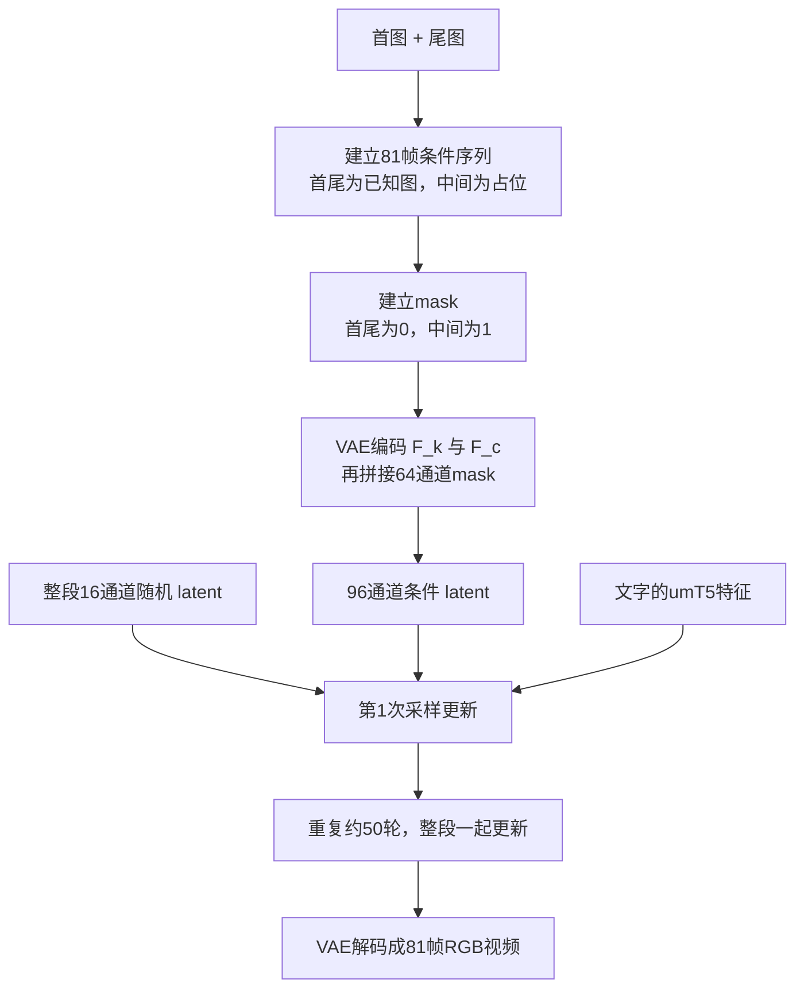

# 版本 1.15：VACE 从 RGB、VAE latent 到首尾帧视频生成的完整数据流

日期：2026-09-16  
本文只解释已经公开的 **Wan2.1-VACE** 结构、训练方式和推理方式，不描述 Demo0 当前的手工特征算法。为避免 1.3B 与 14B 的数字混在一起，正文统一使用 **Wan2.1-VACE-1.3B、480P、81 帧**作为算例：输出宽 832、高 480、81 帧。14B 的主要差异放在文末。

本文依据：

- [Wan2.1 技术报告](https://arxiv.org/html/2503.20314)
- [VACE 论文](https://arxiv.org/html/2503.07598)
- [Wan2.1 官方 VAE 代码](https://github.com/Wan-Video/Wan2.1/blob/main/wan/modules/vae.py)
- [Wan2.1 官方 DiT 代码](https://github.com/Wan-Video/Wan2.1/blob/main/wan/modules/model.py)
- [Wan2.1 官方 VACE 模型代码](https://github.com/Wan-Video/Wan2.1/blob/main/wan/modules/vace_model.py)
- [Wan2.1 官方 VACE 推理代码](https://github.com/Wan-Video/Wan2.1/blob/main/wan/vace.py)
- [VACE 官方首尾帧预处理代码](https://github.com/ali-vilab/VACE/blob/main/vace/annotators/frameref.py)
- [VACE-1.3B 官方配置](https://huggingface.co/Wan-AI/Wan2.1-VACE-1.3B/blob/main/config.json)

---

## 0. 先把最容易混淆的三个“16”彻底分开

我以前说过“16 个像素”，这个说法是错的。这里没有“一个 latent 位置等于 16 个像素”这件事。

准确说法只有下面三条：

1. **一个 VAE latent 空间位置有 16 个浮点特征。**这里的 16 是“通道数”，不是像素数。
2. **一个 VAE latent 空间位置的网格间距相当于原图 8×8 像素。**这是因为高、宽各缩小 8 倍。
3. **一个 DiT Token 合并同一 latent 时间位置上的 2×2 个 VAE latent 空间位置，所以它的网格间距相当于原图 16×16 像素。**这里的 16×16 是画面上的空间尺寸，不是特征数量。

因此：

- `16`：一个 latent 位置存的 16 个特征数；
- `2×2×16=64`：制作一个 DiT Token 时读取的 64 个 latent 数；
- `16×16`：这个 DiT Token 在原画面网格上对应的空间步长；
- `1536`：VACE-1.3B 内部为每个 Token 使用的工作向量长度。

“对应 16×16”不表示这个 Token 只使用框内 16×16 个像素。后文会逐层算出：在 VAE 的全局空间注意力发生以前，一个位置已经有 169×169 的局部空间感受野；全局空间注意力发生以后，理论上它能受到整幅画面的影响。

---

## 1. 本文使用的五个维度分别是什么

深度学习代码通常把视频写成五维数组：

`[B, C, F, H, W]`

- `B`：batch，一次并行处理几段视频；
- `C`：每个位置存几个数；
- `F`：时间方向有几个位置；
- `H`：有多少行；
- `W`：有多少列。

我们只有一段视频，所以 `B=1`。batch 不是视频里多出来的一层，只是“这是一次计算里的第 1 段视频”。如果代码一次只处理这一段，经常把这个 1 省略。

一段 81 帧、每帧 480×832 的 RGB 视频是：

`[1, 3, 81, 480, 832]`

其中 `3` 是红、绿、蓝。每个 RGB 字节通常先从 `[0,255]` 变到 `[-1,1]`：

`p_norm = 2 × p / 255 - 1`

下图只表示数组尺寸怎样变化，不表示每个输出位置只依赖框内输入：


---

## 2. latent 到底是什么

在本文中，**latent 是 VAE 编码器输出的整段压缩视频数组**。

对于 81×480×832 的视频，它是：

`z.shape = [1, 16, 21, 60, 104]`

也可以省略 batch，写成：

`[16, 21, 60, 104]`

这四个数字依次表示：

- 每个位置 16 个浮点数；
- 时间方向 21 个位置；
- 每个时间位置 60 行；
- 每行 104 列。

整个 `[16,21,60,104]` 是 latent。选定 `t=7, y=10, x=20` 后取得的 `[16]`，叫“该 latent 位置的 16 维向量”。不要把“整段 latent”和“一个 latent 位置”叫成同一个“格子”。

### 2.1 为什么是 60 行和 104 列

Wan-VAE 在空间上把高、宽各缩小 8 倍：

- 高：`480 ÷ 8 = 60`；
- 宽：`832 ÷ 8 = 104`。

代码不是一次直接除以 8，而是做三次步长为 2 的空间缩小：

- `480 → 240 → 120 → 60`；
- `832 → 416 → 208 → 104`。

所以 latent 的行列数直接由**送进 VAE 的实际分辨率**决定：一般为 `H_z=H/8`、`W_z=W/8`。程序如果先把图片裁剪或缩放，必须用裁剪、缩放之后的 H、W 计算。

### 2.2 为什么 81 帧变成 21 个时间位置

Wan-VAE 的时间压缩率为 4，但第 1 帧单独留下一个时间位置。因此要求帧数通常写成 `4n+1`：

`81 = 4×20 + 1`，所以 latent 时间长度是 `20+1=21`。

一般公式是：

`F_z = 1 + (F-1)/4`

首个 latent 时间位置对应首帧。以后每增加 4 张原视频帧，latent 时间轴增加 1 个位置。

这只是在说**输出时间位置的数量和步长**。它不表示后面的一个 latent 时间位置只看互不相干的 4 帧。VAE 有多层因果时间卷积和缓存，后面的时间位置还会继承更早帧的信息；第 5 节会精确计算它最多能看到多长的过去。

---

## 3. VAE 编码器逐层做了什么

以下尺寸来自公开代码的实际配置：基础通道数 96、`dim_mult=[1,2,4,4]`、latent 通道数 16、每层有两个残差块。每个残差块包含两个 3×3×3 因果卷积。

| 阶段 | 主要计算 | 输出形状（包含 batch） |
|---|---|---|
| 输入 | RGB，归一化到 `[-1,1]` | `[1,3,81,480,832]` |
| 开头卷积 | 3×3×3 因果卷积，3→96 通道 | `[1,96,81,480,832]` |
| 第 0 级 | 两个残差块；只把空间缩小 2 倍 | `[1,96,81,240,416]` |
| 第 1 级 | 通道 96→192；两残差块；时间和空间都缩小 2 倍 | `[1,192,41,120,208]` |
| 第 2 级 | 通道 192→384；两残差块；时间和空间都缩小 2 倍 | `[1,384,21,60,104]` |
| 第 3 级 | 两个残差块，不再缩小 | `[1,384,21,60,104]` |
| 中间 | 残差块 → 全局空间注意力 → 残差块 | `[1,384,21,60,104]` |
| 输出头 | 3×3×3 因果卷积，384→32 | `[1,32,21,60,104]` |
| 概率参数 | 1×1×1 卷积，然后在通道上平分 | `mu:[1,16,21,60,104]`，`log_var` 同形状 |

VAE 训练时可以用 `mu` 和 `log_var` 采样：

`z_sample = mu + exp(0.5 × log_var) × ε`

其中 `ε` 是标准高斯噪声。公开推理包装器执行 `encode` 时直接返回经过标准化的 `mu`，没有再次为每个输入视频随机采样。

### 3.1 一个卷积输出数字究竟怎样算

把某一层的输入记作 `x`，输出通道记作 `o`，那么一个 3×3×3 卷积输出大致是：

`y[o,t,y,x] = bias[o] + Σ weight[o,i,dt,dy,dx] × input[i,t-dt,y+dy,x+dx]`

求和遍历：

- 上一层所有输入通道 `i`；
- 时间方向卷积核里的位置 `dt`；
- 空间 3×3 邻域里的 `dy,dx`。

因果卷积只用当前和过去，不用未来。卷积核权重是 VAE 训练时学到并保存在 checkpoint 中的参数；推理时不会重新学习。

最终的第 1 个 latent 特征并不固定表示“红色”，第 2 个也不固定表示“边缘”。每个输出通道都有自己的一整套权重，经过许多层组合后共同承担视频压缩。只有给出具体 checkpoint、具体输入视频，实际运行前向计算，才能得到这 16 个具体浮点值。

### 3.2 最后的 16 个数还会按通道标准化

官方代码使用 16 个通道各自的均值和标准差：

`z[c] = (mu[c] - mean[c]) / std[c]`

其中：

```text
mean = [-0.7571, -0.7089, -0.9113,  0.1075,
        -0.1745,  0.9653, -0.1517,  1.5508,
         0.4134, -0.0715,  0.5517, -0.3632,
        -0.1922, -0.9497,  0.2503, -0.2921]

std  = [ 2.8184,  1.4541,  2.3275,  2.6558,
         1.2196,  1.7708,  2.6052,  2.0743,
         3.2687,  2.1526,  2.8652,  1.5579,
         1.6382,  1.1253,  2.8251,  1.9160]
```

这些常数只把各通道调到适合扩散模型处理的数值范围，不给通道规定人类可读的语义。

---

## 4. 一个 latent 空间位置到底用了多大的原图区域

这里必须区分三个概念：

1. **网格步长**：相邻 latent 位置在原图上相隔 8 像素；
2. **局部卷积感受野**：沿卷积路径，某个输出可能受到多大局部窗口影响；
3. **全局注意力依赖范围**：空间注意力以后，它还可能读取全图其它位置。

所谓“8×8 地址框”只描述第 1 项。它不是第 2、3 项的边界。

### 4.1 只沿卷积路径计算，窗口不是 9×9 或 17×17

对 3×3、步长 1 的卷积，感受野每层在当前采样间隔的左右各扩一格；对 3×3、步长 2 的缩小层，不仅扩大窗口，还把后续网格间距乘 2。

按公开编码器逐层静态计算，忽略图像边缘 padding 造成的中心偏移：

| 位置 | 原图空间感受野边长 | 相邻特征在原图上的间距 |
|---|---:|---:|
| 原始像素 | 1 | 1 |
| 开头 3×3 卷积后 | 3 | 1 |
| 第 0 级两个残差块后 | 11 | 1 |
| 第 1 次空间缩小后 | 13 | 2 |
| 第 1 级残差块后 | 29 | 2 |
| 第 2 次空间缩小后 | 33 | 4 |
| 第 2 级残差块后 | 65 | 4 |
| 第 3 次空间缩小后 | 73 | 8 |
| 第 3 级残差块后 | 137 | 8 |
| 中间第一个残差块后 | 169 | 8 |
| 如果拿掉全局注意力，走完剩余卷积后的理论值 | 217 | 8 |

所以，如果 VAE 没有全局空间注意力，最后一个 latent 位置沿局部卷积路径也会有约 **217×217** 的理论窗口，而不是 8×8、9×9 或 17×17。

### 4.2 实际编码器还有一次全图空间注意力

编码器在 60×104 的瓶颈网格上执行一次空间自注意力。代码把 `[B,C,T,H,W]` 变成 `[B×T,C,H,W]`，然后在每个压缩时间位置内把 `H×W` 展平。在 480P 算例中，一个位置会对同一压缩时间位置上的全部 `60×104=6240` 个空间位置计算注意力。

注意力的核心计算是：

`attention(p,q) = softmax_q(Q_p · K_q / sqrt(d))`

`output_p = Σ_q attention(p,q) × V_q`

因此，VAE 编码器最终的一个 latent 位置在**理论依赖关系**上可以受整幅画面影响。这里没有只看局部窗口的 mask。

但“理论上能受全图影响”不等于“16 个数完整保存了整张图片”：

- 每个远处位置的注意力权重可能很小；
- 16 个数是高度有损压缩，不可能逐像素保存整图；
- 实际权重随输入内容变化；
- 要回答某段具体视频里哪个像素影响最大，必须对该 checkpoint 和输入做梯度、遮挡或注意力归因实验。

所以不能列出一个永远不变的“这 16 个数恰好使用了哪 64 个或 256 个像素”的清单。网络不存在这样的固定清单。

### 4.3 为什么仍然可以给 latent 位置画一个框

latent 数组仍然有确定的行列下标。例如 latent 的 `(y=10,x=20)` 是第 10 行、第 20 列。因为空间步长是 8，我们可以在原图上把它的**网格地址**画在大约：

- 横向 `x=160…167`；
- 纵向 `y=80…87`。

这个 8×8 框表示“该 latent 网格地址落在画面的哪里”，方便点击和可视化。它不表示网络只看框内像素。

DiT Token 合并 2×2 个 latent 地址，所以 Token `(y=5,x=10)` 可以在原图上画一个约 16×16 的网格地址框。这个框同样不是严格的信息来源边界。

---

## 5. 一个 latent 时间位置到底使用一帧、四帧，还是更长时间

准确回答是：

- **输出数量上**：首帧产生第一个 latent 时间位置；之后每新增 4 帧产生一个 latent 时间位置；
- **运算依赖上**：后面的 latent 时间位置不仅依赖那 4 张新帧，还通过多层因果卷积和缓存依赖更早的帧；
- **VAE 内没有跨时间自注意力**：时间融合由 3D 因果卷积完成；
- **DiT 内有全时空自注意力**：进入扩散模型后，Token 才通过同一项自注意力跨所有时间和空间位置交互。

### 5.1 四帧不是展平后直接拼到 16 个数里

官方推理为了省显存，把输入按 `1,4,4,4…` 分块送进编码器，并缓存每层前面的特征。四张新帧经过很多层 3D 卷积、非线性、残差连接和两次时间缩小，最后在 latent 时间轴上增加一个位置。

不存在以下结构：

`第1帧4个数 + 第2帧4个数 + 第3帧4个数 + 第4帧4个数 = 16个数`

实际情况是 16 个输出通道中的每一个，都可能混合多帧、多空间位置和许多中间通道。

### 5.2 公开代码下的理论时间感受野

只计算因果卷积路径，一个最终 latent 时间位置最多可依赖约 **113 个原始帧位置**，并且只向当前及过去展开，不读取未来。逐级计算如下：

| 位置 | 理论时间感受野 | latent 步长对应的原帧间隔 |
|---|---:|---:|
| 原始帧 | 1 | 1 |
| 开头因果卷积后 | 3 | 1 |
| 第 0 级残差块后 | 11 | 1 |
| 第 1 级残差块后 | 19 | 1 |
| 第 1 次时间缩小后 | 21 | 2 |
| 第 2 级残差块后 | 37 | 2 |
| 第 2 次时间缩小后 | 41 | 4 |
| 第 3 级残差块后 | 73 | 4 |
| 中间第一个残差块后 | 89 | 4 |
| 中间第二个残差块后 | 105 | 4 |
| 编码器输出卷积后 | 113 | 4 |

这是依据公开层数、卷积核和步长得到的**理论最大依赖跨度**。对 81 帧视频，最后面的 latent 时间位置理论上已经可能依赖从首帧到尾帧的全部过去；早期位置因为没有那么多历史帧，只能使用已有帧和因果 padding。

因此，把第 `t>0` 个 latent 时间位置说成“只代表某四帧”不够准确。更准确的说法是：**它每次接收四张新帧并向前推进一个 latent 时间位置，但其状态还继承更早历史。**

### 5.3 VAE 有没有时间注意力

VAE 的中间注意力把时间维并入 batch：每个压缩时间位置分别做全图空间注意力，所以 **VAE 没有跨时间注意力**。时间信息来自因果 3D 卷积。

DiT 的情况不同。DiT 把所有时间、行、列 Token 展成同一序列，使用无局部窗口限制的自注意力，所以 **DiT 有全时空注意力**；每个当前生成 Token 可以读取所有时间位置和所有空间位置的 Token。

---

## 6. 从 VAE latent 到 DiT Token

VAE 输出：

`[1,16,21,60,104]`

VACE-1.3B 的 patch embedding 是一个卷积核和步长都为 `(1,2,2)` 的 3D 卷积。这里的三个数依次是：

- 时间方向取 1 个 latent 时间位置；
- 高度方向取相邻 2 行；
- 宽度方向取相邻 2 列。

所以初始制作一个 Token 时读取：

`1×2×2×16 = 64` 个 latent 浮点数。

这个步骤**不合并相邻 latent 时间位置**，只合并同一个 latent 时间位置上的 2×2 个空间位置。

patch embedding 用学习到的权重把 64 个输入数变成 1536 个数：

`token[j] = bias[j] + Σ_k W[j,k] × patch[k]`，`j=1…1536`

1536 不是 64 个输入简单复制 24 次，也没有“第 24 层帧信息”。它是模型设计者选择的隐藏宽度，1536 个输出是 1536 组不同的加权组合。

空间网格从 60×104 变为 30×52，时间仍为 21，所以 Token 数是：

`L = 21×30×52 = 32760`

进入 Transformer 的形状是：

`[B,L,D] = [1,32760,1536]`

Token 是 `[1536]` 工作向量；Token 的“身份”还包括它在 `21×30×52` 网格中的时间、行、列下标。

---

## 7. Token 的位置信息在哪里

要分两层回答：

### 7.1 VAE 的 16 个数里没有直接拼入三个坐标

VAE 没有在每个 16 维向量末尾再拼接 `(t,y,x)` 三个数。位置首先由它在 `[21,60,104]` 数组中的下标决定。卷积的邻接关系、图像边界和因果时间方向也会让网络间接感受到结构位置。

### 7.2 DiT 注意力显式使用三维位置编码

DiT 把序列还记作 `(时间,行,列)` 网格，并把三维 RoPE 位置编码作用到注意力的 Q、K 上。于是两个内容相似的纯色天空 Token 即使 1536 维内容很像，注意力得分仍可能因为时间或空间位置不同而不同。

这类位置偏好可以让“接近原坐标”的候选看起来较准确，但不能自动说明模型从视觉内容中认出了同一个天空区域。

---

## 8. VAE 是怎样训练出来的

这部分只讲 **VAE 的训练**，不讲扩散模型训练。

Wan 技术报告公开了三个阶段：

1. 先训练同结构的 2D 图像 VAE；
2. 把 2D 权重扩展成 3D 因果 VAE，在 128×128、5 帧视频上训练；
3. 在不同分辨率、不同帧数的高质量视频上继续微调，并加入 3D 判别器的 GAN 损失。

训练输入是真实图片或视频 `V`。编码器生成 `mu,log_var`，训练时采样 latent；解码器产生重建视频 `V_hat`。公开报告给出的主要损失是：

`L_VAE = 3×L1(V_hat,V) + 3×LPIPS(V_hat,V) + 3e-6×KL + GAN项`

- `L1`：逐像素绝对误差，要求重建画面数值接近原视频；
- `LPIPS`：使用感知网络比较视觉特征，要求人眼感受接近；
- `KL`：约束 latent 分布不要任意发散，保留可采样的连续空间；
- `GAN`：后期由 3D 判别器推动重建结果更清晰、真实。

训练对象包括 VAE 编码器、VAE 解码器；GAN 阶段还训练判别器。训练结束后，卷积核、注意力投影、归一化系数等都保存在 VAE checkpoint。VACE 推理时加载并冻结这些参数。

公开技术报告没有列出 3D 判别器的所有实现代码和 GAN 项的全部系数。因此，这部分不能从当前公开材料继续精确到判别器每一层和最终 GAN 权重。

---

## 9. 基础 Wan 扩散模型是怎样训练的

这部分训练的是 **DiT 生成模型**，不是重新训练 VAE。

对一段有文字描述的真实视频：

1. 冻结的 VAE 把真实视频编码成干净 latent，记作 `x1`；
2. 随机生成同形状高斯噪声 `x0`；
3. 从 `[0,1]` 随机采样一个时间 `t`；
4. 制造介于噪声和真实视频之间的训练输入：

   `x_t = t×x1 + (1-t)×x0`

5. 它沿这条直线应该前进的真实速度是：

   `v_t = x1 - x0`

6. umT5 把文字变成最多 512 个文字 Token；
7. DiT 读取 `x_t`、`t` 和文字，预测速度 `u(x_t,text,t)`；
8. 用均方误差训练：

   `L_flow = mean((u - v_t)^2)`

基础 Wan 训练阶段优化 DiT 参数；VAE 编码器和文字编码器被冻结。模型学到的是：面对某种噪声程度、某段文字和某个带噪整段视频 latent，应当把整个 latent 往什么方向修改。

它没有记住一张固定的 32760×32760 注意力表。Q/K/V 投影参数是训练学到的，但每次注意力权重由当前输入重新计算。

---

## 10. VACE 条件模块是怎样训练的

VACE 在已经训练好的 DiT 旁边加入一条条件支路。训练样本不再只有“文字—目标视频”，还包括：

- 目标视频；
- 文字；
- 条件帧序列 `F`；
- 二值 mask 序列 `M`；
- 可选参考图片。

mask 约定：

- `M=0`：这个像素属于应保留的已知内容；
- `M=1`：这个像素允许重新生成或属于控制信号。

VACE 将条件帧分成两份：

`F_k = F × (1-M)`：保留内容，也叫 inactive；

`F_c = F × M`：待变化/控制内容，也叫 reactive。

`F_k` 与 `F_c` 分别通过同一个冻结 VAE 编码成 16 通道 latent，然后在通道方向拼接成 32 通道。mask 不走 VAE，而是把原图每个 8×8 mask 小块重排成 64 个通道，并对齐到 latent 的时间、行、列。最终条件张量是：

`16(F_k) + 16(F_c) + 64(mask) = 96 通道`

形状为：

`[1,96,21,60,104]`

VACE 条件 patch embedding 同样使用 `(1,2,2)` 卷积，因此每个条件 Token 开始时读取：

`1×2×2×96 = 384` 个条件数，随后变成 1536 维。

VACE-1.3B 有 15 个 Context Block。第一个 Context Block 先把当前生成视频 Token `x` 加入条件 Token `c`；每个 Context Block 都有全时空自注意力、文字交叉注意力和前馈网络，并输出一个 hint。15 个 hint 分别加到主干第 `0,2,4,…,28` 个块的输出之后。

VACE 论文写明：训练时冻结原 DiT 主干，训练 Context Embedder 和 Context Blocks。论文没有在正文中重新公开一套与 Wan 基础模型不同的损失公式；公开仓库也主要提供推理代码。因此当前能严谨写出的范围是：VACE 在目标视频生成任务上继续训练条件支路，训练信号沿用基础扩散/流预测任务；但首尾帧任务是否有额外端点加权、各类任务的采样权重和所有内部超参数，公开材料不足以给出唯一精确答案。

---

## 11. 给首帧和尾帧两张 RGB 图片时，推理全过程

下面假设要求生成 81 帧、480×832 的过渡视频，并给出文字提示。



### 第 1 步：把两张图片变成条件视频和 mask

官方 `firstlastframe` 预处理器把第一张图放在序列开头、第二张图放在序列末尾，中间填灰色占位帧；已知的首、尾帧 mask 为 0，中间未知部分 mask 为 1。第二张图会先对齐第一张图的尺寸。

最终送入模型的序列必须由视频处理器对齐到请求的 `4n+1` 帧数。对 81 帧目标，从模型张量角度看就是：

```text
条件帧： [首图, 79个未知占位位置, 尾图]
mask：   [  0,  79个全1的位置,   0]
```

官方预处理器单独运行时的 `expand_num` 表示插入多少占位帧；它的原始输出还会经过推理视频处理器的帧数对齐。计算 latent 形状时应以最终送进 VAE 的帧数为准，不能只看预处理文件暂时有多少帧。

### 第 2 步：归一化和尺寸对齐

首、尾图被缩放/裁剪到目标空间尺寸，RGB 从 `[0,255]` 变成 `[-1,1]`。占位灰色 127.5 在归一化后约为 0。

### 第 3 步：构造 96 通道 VACE 条件

由 mask 得到：

- `F_k`：首尾图保留，中间为 0；
- `F_c` 的 RGB 输入：在纯首尾帧过渡任务中基本为 0，因为中间只有归一化后的零占位，首尾又被 mask 排除；但它经过带偏置和历史缓存的 VAE 后，所得 latent 不保证逐项严格等于 0；
- `M`：明确告诉模型哪些位置已知、哪些位置要生成。

VAE 分别编码 `F_k` 和 `F_c`，得到两个 `[16,21,60,104]`；mask 变成 `[64,21,60,104]`。三者拼成：

`vace_context = [96,21,60,104]`

这里还存在时间方向的不对称：VAE 是因果的，所以首帧条件不会读取未来尾帧；靠后的尾帧条件可以通过历史卷积路径受到更早首帧和中间占位序列影响。首、尾图虽然都在同一条件视频中，却不是一次把两张图对称地展平后拼接。

这里的首尾帧是**条件信息**，不是直接写入待生成 latent 后永远锁死的像素。模型通过训练学会遵守 mask 和条件 hint，因此这是学习到的约束，不是每轮把首尾 RGB 强行复制回结果的硬约束。

### 第 4 步：文字编码

umT5 将提示词编码为最多 512 个文字 Token。文字决定主体、动作、镜头、风格等；VACE 主干和条件块均通过文字交叉注意力读取这些 Token。

### 第 5 步：创建整段随机 latent

程序创建：

`x = randn([16,21,60,104])`

它对应整段 81 帧视频。不是每帧单独创建一次噪声，也不是生成一帧后再生成下一帧。

### 第 6 步：一次采样轮内部做什么

VACE-1.3B 每一轮按以下顺序运行：

1. 当前 `x` 经 `(1,2,2)` patch embedding，成为 `[1,32760,1536]`；
2. 96 通道条件经自己的 patch embedding，也成为 `[1,32760,1536]`；
3. 当前采样时间 `t` 被编码，用来调节各 Transformer 块的归一化、残差强度等；
4. 15 个 VACE Context Block 处理条件 Token。每块都做一次条件 Token 的全时空自注意力、一次对文字的交叉注意力、一次前馈网络，产生 15 个 hint；
5. 30 个主干 DiT Block 依次处理生成 Token。每块执行：
   - 当前生成视频 Token 的全时空自注意力；
   - 对文字 Token 的交叉注意力；
   - 前馈网络；
   - 在指定块之后加对应的 VACE hint；
6. 输出头把每个 1536 维 Token 变成 64 个预测数；
7. 64 个数按 `2×2×16` 放回 latent 网格，恢复 `[16,21,60,104]` 的整段流/速度预测；
8. 使用 CFG 时，同一轮还会用负面/空文字再前向一次，然后组合两次预测；
9. 采样器根据预测更新整个 `x`。

主干自注意力把 32760 个视频 Token 当成一条全时空序列。VACE-1.3B 每个注意力有 12 个头，每头 128 维，因为 `1536÷12=128`。每个 Token 的 Q 会和整段视频所有有效 Token 的 K 匹配；3D RoPE 告诉 Q/K 各自的时间、行、列位置。

VAE 中没有时间注意力，但这里的 DiT 自注意力同时跨时间和空间，而且不是因果的：当前第 10 个时间位置可以读取第 1 个和第 20 个生成时间位置。所有位置都是当前这一轮的生成状态，没有“未来真实帧泄露”。尾图的真实信息在 VACE 条件支路中。

### 第 7 步：重复约 50 轮

开始时 `x` 接近纯噪声。每一轮都重新计算 patch embedding、Q/K/V、注意力和条件 hint，再更新整段 `x`。上一轮的 Q/K/V 不作为一个独立历史数据库传到下一轮；传下去的是更新后的 latent `x`。

官方入口默认 `sampling_steps=50`，可以修改。使用 CFG 时每轮通常做两次模型前向，所以 50 轮下，1.3B 主干自注意力约执行 `50×2×30=3000` 次，VACE 条件自注意力约执行 `50×2×15=1500` 次。

### 第 8 步：VAE 解码

最后得到的 `[16,21,60,104]` latent 先反标准化，再经过 VAE 解码器：

```text
[16,21,60,104]
  → 全局空间注意力与残差块
  → [192,41,120,208]
  → [192,81,240,416]
  → [96,81,480,832]
  → [3,81,480,832]
```

解码器同样使用因果时间卷积和缓存，并在低分辨率网格上使用一次每个时间位置内的全局空间注意力。最后三个通道还原为 RGB，数值限制到 `[-1,1]` 后再转换成可保存的视频像素。

---

## 12. 训练和推理不能混在一起说

| 模块 | 训练时输入 | 训练谁 | 损失/目标 | 推理时是否还学习 |
|---|---|---|---|---|
| Wan-VAE | 真实图片/视频 | 编码器、解码器；后期还有判别器 | L1、LPIPS、KL、后期 GAN | 否，加载固定权重 |
| 基础 Wan DiT | 真实视频 latent、随机噪声、随机时间、文字 | DiT | 预测流速度的 MSE | 否，反复调用固定模型 |
| VACE 条件模块 | 目标视频、文字、条件帧、mask、参考图 | Context Embedder、Context Blocks；原 DiT 冻结 | 沿用目标视频生成的扩散/流预测训练；公开材料未列全额外细节 | 否，加载固定权重 |

推理不是“模型看两张图以后现场继续训练”。推理只是用训练好的固定参数反复计算，把随机 latent 逐步更新为视频 latent。

---

## 13. 对“到底用了哪些原始像素”的最终回答

### 能精确回答的部分

- 一个 VAE latent 位置有 16 个数，不是 16 个像素；
- VAE 空间网格步长是原图 8×8；
- 一个 DiT Token 合并 2×2 latent 空间位置，Token 网格步长是原图 16×16；
- VAE 卷积路径的最终局部理论空间感受野约为 217×217；
- VAE 在中间加入每个压缩时间位置内的全图空间注意力，所以实际理论空间依赖扩展到整幅图；
- VAE 没有时间注意力，但因果时间卷积的理论最大历史跨度约为 113 帧；
- DiT 有全时空自注意力，一个 Token 在每个主干块中可以读取整段当前生成视频的全部 Token；
- 位置通过数组下标和 DiT 的三维 RoPE 参与计算。

### 不能仅靠结构静态回答的部分

无法仅看架构就说：某个具体 latent 数值有 37% 来自像素 A、12% 来自像素 B。原因是：

- 卷积权重来自具体 checkpoint；
- 非线性和残差层使路径很多；
- 全局空间注意力的权重依赖当前输入；
- 16 个最终特征经过多次通道混合；
- 边界、padding 和历史缓存也会改变实际路径。

要回答某个视频、某个 latent 通道“实际最依赖哪些像素”，需要加载真实 VAE checkpoint，选择一个输出标量 `z[c,t,y,x]`，对输入 RGB 求梯度，或者逐块遮挡输入再观察该标量变化。这能得到**具体样本的有效感受野**；固定的 16×16 白框只能表示网格地址，不能代替这种测量。

---

## 14. 对 Demo0 和运动投票实验的直接含义

1. 不能再把绿色 1×1 小格解释为“VACE Token 只包含这一块像素”。它最多表示 Token 的空间网格地址。
2. 如果 Demo0 要验证未来真正修改的 VACE Token，应使用真实 Wan-VAE 输出和真实 `(1,2,2)` patch embedding，时间上也使用 21 个 latent 时间位置，而不是给 81 张原始帧各建一套独立 Token。
3. 因为 VAE latent 已经有全图空间混合和较长的因果时间历史，单纯比较 16 维 latent 或 1536 维 Token 的相似度，可能混入背景、全局结构和位置偏好；这必须在实验解释中注明。
4. 正式生成时“当前帧的真实画面”不存在。候选如果要在每个采样轮更新，查询特征必须来自当轮生成 latent/hidden；干净首尾图的参考特征来自 VACE 条件支路。
5. 我们希望注入的是“当前生成 Token 到干净首/尾条件 Token”的运动候选偏置。原 VACE 主干自注意力读取的是当前整段生成状态，不等于直接读取干净首帧 RGB。
6. 不应在尚未实验前把全部全局注意力硬裁成首帧 Top-8。当前 Token 仍可能需要同时间位置邻域、相邻时间位置和少量全局生成上下文；运动投票更适合作为参考条件连接的稀疏 bias 或额外 K/V 路径，并在后期低噪声采样轮做对照实验。

---

## 15. 1.3B 与 14B 哪些数字相同、哪些不同

两者使用同样的 Wan-VAE 几何：16 latent 通道、时间压缩 4 倍、空间压缩 8×8、DiT patch 为 `(1,2,2)`。因此同分辨率、同帧数时 Token 数量相同。

| 项目 | VACE-1.3B | VACE-14B |
|---|---:|---:|
| Token 隐藏维度 | 1536 | 5120 |
| 主干块数 | 30 | 40 |
| 注意力头数 | 12 | 40 |
| 每头维度 | 128 | 128 |
| VACE Context Block 数 | 15 | 8 |
| 条件注入主干索引 | 0,2,…,28 | 0,5,…,35 |

本文出现的 1536、30 块、12 头、15 个条件块，都只指 VACE-1.3B；不能拿去描述 14B。

---

## 16. 一句话版数据流

真实视频在训练时由 VAE 压成 16 通道时空 latent；DiT 学会把同形状噪声沿流匹配方向变回视频 latent；VACE 额外把首尾图、mask 和文字加工成条件 hint。推理时，两张 RGB 图不直接变成整段输出，而是作为条件；一整段随机 latent 同时经过约 50 轮全时空 Transformer 更新，最后由 VAE 一次解码为完整过渡视频。
